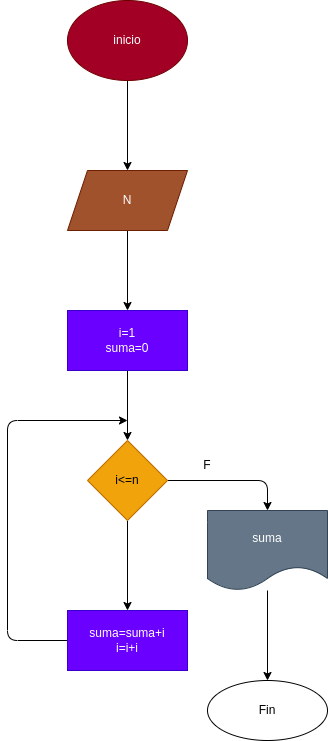

# Realizar la suma de n numeros enteros con el operador while
## diagrama de flujo

hacer el diagrama de flujo y el programa en python que lea un capital c, y que averigue e imprima en cuantos meses se duplica si lo colocamos a un interses compuesto del 5% mensual